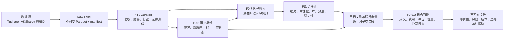

# Quant Research Platform

面向 A 股中低频研究的、时点严格且可复现的量化研究平台。

> Point-in-time aware, content-addressed and fail-closed research infrastructure for
> medium/low-frequency China A-share strategies.

本项目覆盖从数据接入、时点化处理、因子构建、单因子评测，到可交易组合回测与研究报告生成的完整链路。平台首先回答“当时是否真的知道、是否真的可以买、结果是否能够复现”，再讨论因子收益。

## 项目解决什么问题

常见的量化回测可能因为未来数据、动态复权、幸存者偏差、停牌与涨跌停处理、交易成本低估而产生虚假表现。本项目将这些风险设计成显式的数据契约和晋级门禁：

- **时点严格**：区分市场发生、数据可得、研究冻结、决策、执行和结果观察时间；
- **内容寻址**：数据、配置、代码和报告均通过哈希绑定，不覆盖历史产物；
- **失败关闭**：缺行情、缺涨跌停、未知证券状态或容量输入缺失时不做乐观猜测；
- **机构化执行**：纳入 T+1、停复牌、涨跌停、申报数量、公司行为、佣金、印花税、滑点、冲击和容量；
- **研究与交易分层**：因子层只使用决策时可知信息，执行层单独处理下一交易日能否成交；
- **结论可审计**：正式报告引用不可变 artifact、输入 SHA-256、clean Git commit 和冻结环境。

## 全流程架构



数据标签与收益标签物理分离；`decision_at < execution_at < outcome_observation_end_at`。P0.7 的工程晋级只说明“评测可信”，只有继续通过 P0.6.3 才能讨论净经济性。

## 当前完成度

| 模块 | 核心问题 | 状态 | 主要证据 |
|---|---|---:|---|
| P0 / P0.8 | 不可变接入、财务修订、历史行业、证券身份 | 已完成 | [PIT 财务标准](docs/p08_fundamental_pit_standard.md) |
| P0.G0 | Git、环境锁、内容寻址与正式发布 | 已完成 | [可复现标准](docs/reproducibility_standard.md) |
| P0.5 | 当日研究资格与 A 股特殊交易状态 | 已完成 | [可交易性标准](docs/p05_tradability_standard.md) |
| P0.6.1 | 订单、T+1、部分成交、容量与组合会计 | 已完成 | [执行标准](docs/p06_execution_standard.md) |
| P0.6.2 | 公司行为、事件时钟与逐日组合账本 | 已完成 | [组合回测标准](docs/p062_portfolio_backtest_standard.md) |
| P0.6.3 | 波动率冲击、最低佣金、容量与估值边界 | 已完成 | [交易成本标准](docs/p063_execution_cost_standard.md) |
| P0.7 | PIT 单因子评测与组合暴露门禁 | 已完成 | [单因子评测标准](docs/p07_single_factor_evaluation_standard.md) |
| 因子研究 | rev20_skip1 与 SP 的端到端实验 | 已完成首轮 | [研究报告索引](docs/research/README.md) |
| 组合构建 | 持股数、缓冲区、多因子合成与约束优化 | 下一阶段 | [研究路线](docs/project_journey.md) |

模块编号表示工程职责，不完全代表开发先后顺序。完整建设过程见[项目演进与关键决策](docs/project_journey.md)。

## 已贯通的研究案例

首轮使用两个换手特征相反的因子检验全链路：

- `rev20_skip1`：跳过最近一日的 20 日反转，日频变化、预期高换手；
- `sp_ttm`：PIT TTM 营业收入 / 决策时点市值，财报驱动、预期低换手。

在相同的 2023 年可交易域、1,000 万元初始资金、公司行为、费用和执行情景下：

| 基础执行指标 | SP | rev20_skip1 |
|---|---:|---:|
| 净收益 | 12.57% | 2.41% |
| 代理毛收益 | 14.73% | 11.44% |
| 费用与滑点 / 初始资金 | 2.16% | 9.03% |
| 成本占代理毛利 | 14.68% | 78.95% |
| 成交额 / 平均 NAV | 7.21x | 37.99x |
| 最大回撤 | -10.05% | -14.81% |

结果支持“反转收益主要被高换手侵蚀，而非所有因子都无法穿过成本层”。但这不是实盘承诺：SP 仍存在小额订单过多、严格容量下界为零和单年执行样本有限等问题。完整口径和限制见 [SP 与 rev20 净经济性对照](docs/research/sp_vs_rev20_net_economics_2023.md)。

## 快速开始

### 1. 安装

```bash
git clone https://github.com/EddieDeng0207/quant_research_platform.git
cd quant_research_platform
python3 -m venv .venv
.venv/bin/pip install -e '.[china,dev]'
```

Python 要求 `>=3.9`。完整依赖版本保存在 `requirements.lock`。

### 2. 配置密钥

在项目根目录创建不会被 Git 跟踪的 `.env`：

```bash
TUSHARE_TOKEN=your_token
FRED_API_KEY=your_key
```

程序只记录密钥是否存在，不记录密钥值。不要把 `.env`、授权数据或原始凭据提交到 GitHub。

### 3. 验证代码环境

```bash
.venv/bin/pytest
.venv/bin/ruff check src tests
.venv/bin/qrp-data providers
```

没有商业数据权限也可以运行单元测试和阅读冻结报告；重建正式全市场实证结果需要相同的授权数据及其不可变 raw 快照。

### 4. 查看工作流

```bash
.venv/bin/qrp-data --help
.venv/bin/qrp-data build-sales-to-price-inputs --help
.venv/bin/qrp-data build-factor-execution-inputs --help
.venv/bin/qrp-data build-backtest --help
```

从接入到报告的可执行示例见[复现与运行指南](docs/getting_started.md)。

## 仓库结构

```text
quant_research_platform/
├── src/qrp/                 # 数据、研究、执行与回测核心代码
│   ├── data/                # 接入、PIT、复权、行业、P0.5
│   ├── research/            # 因子注册、输入构建、评测与实验治理
│   ├── execution/           # 成交约束、容量、费用与组合会计
│   └── backtest/            # 多情景逐日回测与报告
├── tests/                   # 单元、边界和回归测试
├── configs/                 # 可审计的供应商优先级与证券别名
├── docs/                    # 工程标准、项目演进和研究报告
├── releases/                # 正式版本清单及证据哈希
├── scripts/                 # 审计和历史迁移辅助脚本
└── requirements.lock        # 冻结依赖
```

大型数据湖、授权数据和内容寻址 artifact 不进入 Git；正式报告和 release manifest 进入 Git，保留可验证的产物身份。

## 推荐阅读顺序

如果你是第一次评阅本项目，建议按以下顺序阅读：

1. 本页：理解研究目标、架构和当前结论；
2. [项目演进与关键决策](docs/project_journey.md)：理解为什么逐步增加这些门禁；
3. [可复现研究与交付标准](docs/reproducibility_standard.md)：理解证据链；
4. [P0.7 单因子评测标准](docs/p07_single_factor_evaluation_standard.md)：理解统计评测；
5. [P0.6.3 交易成本标准](docs/p063_execution_cost_standard.md)：理解净收益如何形成；
6. [SP 正式 P0.7 报告](docs/research/sp_ttm_factor_evaluation_2016_2026.md)；
7. [SP 正式 P0.6.3 报告](docs/research/sp_ttm_p063_2023.md)；
8. [SP 与反转因子对照结论](docs/research/sp_vs_rev20_net_economics_2023.md)。

全部文档的用途和权威状态见[文档中心](docs/README.md)。

## 可复现边界

项目区分三种复现层级：

| 层级 | GitHub 克隆后是否可完成 | 说明 |
|---|---:|---|
| 代码与工程测试 | 是 | 安装开发依赖后直接运行 `pytest` |
| 报告证据验证 | 是 | 报告、release manifest、代码版本和哈希均被跟踪 |
| 全市场实证重算 | 需要授权数据 | 需使用相同供应商权限和内容寻址 raw lake |

数据不可公开不等于研究不可审计：报告会冻结数据哈希、schema、研究截止时点、代码 commit、环境锁和所有硬门禁结果。详见[版本控制与发布标准](docs/version_control_and_release_standard.md)。

## 当前边界与下一步

- 当前正式执行对照只覆盖 2023 年，尚不能替代跨市场状态的样本外验证；
- 日线模型不能还原集合竞价排队和盘中开板，真实成交回报接入前冲击参数仍是研究假设；
- 分析师预期必须使用带历史快照或变更时间的授权数据源；
- 下一阶段优先建设组合构建层：Top-N、行业约束、缓冲区、累积偏离触发、资金敏感性和多因子合成；
- 任何“晋级通过”只代表工程和研究门禁通过，不代表已经适合实盘。

## 开发与贡献

代码风格、测试、分支、PR 和数据安全要求见 [CONTRIBUTING.md](CONTRIBUTING.md)。每次正式研究变更都应说明冻结输入、artifact 身份、晋级门禁、经济解释和已知边界。
