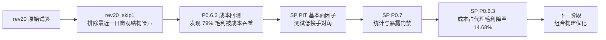

# 研究报告索引

本目录保留正式研究报告和问题诊断过程。为了防止多个 `_v2`、`_v3` 文件造成口径混乱，本页明确当前推荐入口；旧文件继续保留用于审计，不覆盖、不删除。

## 当前正式口径

| 研究 | 报告 | 状态 | 主要用途 |
|---|---|---:|---|
| SP 单因子 | [2016–2026 P0.7 评测](sp_ttm_factor_evaluation_2016_2026.md) | 当前正式 | PIT 基本面输入、IC、分层、稳定性和暴露门禁 |
| SP 执行 | [2023 P0.6.3 回测](sp_ttm_p063_2023.md) | 当前正式 | 成交、成本、容量、公司行为和估值上下界 |
| 因子对照 | [SP vs rev20_skip1](sp_vs_rev20_net_economics_2023.md) | 当前正式 | 同口径比较毛收益、成本和净收益 |
| 反转执行 | [rev20_skip1 bounded v3](rev20_skip1_p063_2023_bounded_v3.md) | 当前正式基线 | 长停牌估值上下界后的反转执行结论 |

## 研究顺序



## 诊断与历史版本

以下文件记录研究迭代过程，适合审计问题是如何被发现和修复，不应替代上面的当前正式报告：

| 文件组 | 状态 | 保留原因 |
|---|---:|---|
| `rev20_diagnostic_report*.md` | 历史诊断 | 原始反转窗口与数据/统计问题定位 |
| `rev20_pilot_conclusion*.md` | 历史结论 | 不同门禁版本下的阶段性判断 |
| `rev20_skip1_pilot_report*.md` | 历史试验 | skip1 首次运行及修订过程 |
| `rev20_skip1_p063_2023_diagnostic*.md` | 历史诊断 | 成交、容量和成本层问题定位 |
| [SP 范围预检](sp_scope_preflight_2022_2023.md) | 预检 | 正式 SP 运行前的数据范围与覆盖检查 |

## 报告解读规则

1. 优先阅读“当前正式口径”，不要从历史文件中挑选最优数字；
2. `promotion_passed = true` 表示冻结工程门禁通过，不表示因子可直接实盘；
3. P0.7 结论必须与 P0.6.3 成交结果分开；
4. 比较因子时必须使用相同股票池、区间、资金、费用和执行情景；
5. 容量为零时不得用正容量日条件中位数替代严格下界；
6. 所有收益必须同时阅读 gross proxy、fees、slippage、net 和 drawdown。

## 不可变证据链

正式报告中的数字由冻结 artifact 自动生成或从同口径 artifact 派生。每条正式链路至少包含：

```text
raw snapshot hash
  -> curated/PIT artifact_id
  -> factor input artifact_id
  -> P0.7 artifact_id
  -> execution input artifact_id
  -> P0.6.3 artifact_id
  -> Git-tracked report
```

若代码、配置、输入哈希或研究截止时点变化，必须生成新的 artifact 和报告，不能原地覆盖旧结论。
